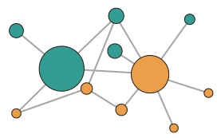
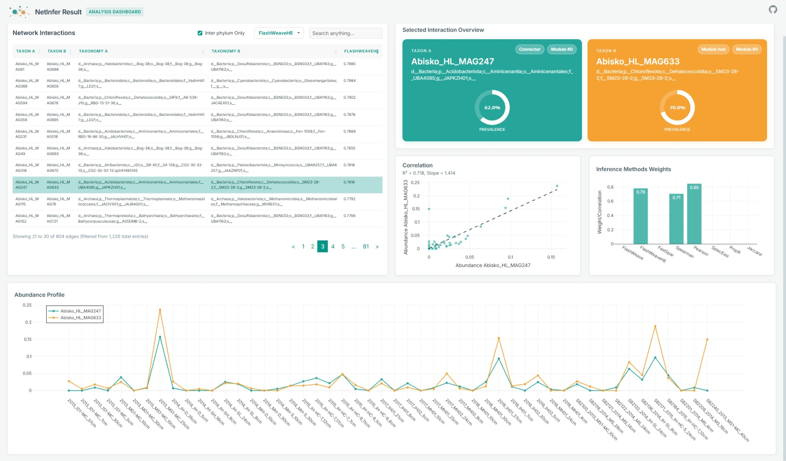

# NetInfer

[](https://opensource.org/licenses/MIT)
[](https://snakemake.github.io)
[](https://docs.conda.io/en/latest/)

A Snakemake-based pipeline for inferring microbiome co-abundance networks, integrating multiple inference tools in one workflow.

## Features

- Multiple network inference methods:
  - Direct Association Methods:
      - [FlashWeave (HE mode/normal mode)](https://github.com/meringlab/FlashWeave.jl)
      - [SPIEC-EASI](https://github.com/zdk123/SpiecEasi)
  - Correlation-based Methods:
      - [FastSpar](https://github.com/scwatts/fastspar)
      - [propR](https://www.nature.com/articles/s41598-017-16520-0)
      - [Spearman correlation with FDR correction](https://en.wikipedia.org/wiki/Spearman%27s_rank_correlation_coefficient)
      - [Pearson correlation with FDR correction](https://en.wikipedia.org/wiki/Pearson_correlation_coefficient)  
      - [Jaccard Index](https://en.wikipedia.org/wiki/Jaccard_index)

- Interactive HTML dashboard
- Flexible input formats (TSV, CSV, BIOM)
- Comprehensive output with consensus scores
- Parallel execution support
- Conda environment management

Output interactive html dashboard:



We provide an example in [example](example) directory, where you can learn the input file format and the expected output.

## Quick Start

### Prerequisites

- [Conda](https://docs.conda.io/en/latest/miniconda.html) (or [Mamba](https://github.com/mamba-org/mamba))

### Installation

```bash
# Clone the repository
git clone https://github.com/SilentGene/netinfer.git
cd netinfer

# Create and activate conda environment
conda env create -f environment.yaml  # creates 'netinfer' environment and installs dependencies
conda activate netinfer

# Install FlashWeave by running the provided Julia package
julia workflow/scripts/install_flashweave.jl
```

### Basic Usage

1. Prepare your data:
   - Required: abundance table `abundance_table.tsv`
   - (Optional) taxonomy table `taxonomy.tsv` for additional annotations
   - (Optional) sample metadata table `metadata.tsv` for `FlashWeave` and additional annotations

2. Run the pipeline:
```powershell
# Simple run with all methods enabled and using default settings
netinfer --input abundance_table.tsv --output results_dir --threads 6

# Include taxonomy to allow more information in the output and produce a addictional file with associations between different phyla
netinfer --input abundance_table.tsv --output results_dir --threads 6 --taxonomy taxonomy.tsv

# I don't have a separate taxonomy file, but let's try to infer from feature IDs
netinfer --input abundance_table.tsv --output results_dir --threads 6 --infer-taxonomy

# Only use my favorite methods, and use my own suffix for output files
netinfer --input abundance_table.tsv --output results_dir --threads 6 --methods flashweave,fastspar,spearman --suffix samples007

# Skip visualization
netinfer --input abundance_table.tsv --output results_dir --threads 6 --no-visual

# I'm an expert: specify every detail with my own config file
netinfer --input abundance_table.tsv --output results_dir --threads 6 --config my_config.yaml
```

### Output

The pipeline generates:
1. Filtered and processed input data (`results/preprocessed_data/`)
2. Individual network files for each method (`results/subtool_outputs/`)
3. Merged network with consensus scores (`results/final_results/merged_edges.tsv`)
4. Interactive HTML dashboard (`results/final_results/netinfer_dashboard.html`)


## Input File Formats

### Abundance Table
> No matter what column names are, the first column will always be treated as Feature IDs, and the rest columns as Sample IDs.
- Format: TSV/CSV/BIOM
- Rows: Features (OTUs/ASVs)
- Columns: Samples
- Values: Raw counts or relative abundances

Example:
```
Feature        Sample1  Sample2  Sample3
OTU1           100      150      80
OTU2           50       60       40
...
```

### Taxonomy Table (Optional)
> No matter what column names are, the first column will always be treated as Feature IDs, and the second column as Taxonomy strings.
- Format: TSV/CSV
- Required columns: 
  - Feature ID (matching abundance table)
  - Taxonomy string

Example:
```
Feature  Taxonomy
OTU1     d__Bacteria;p__Firmicutes;c__Clostridia
OTU2     d__Bacteria;p__Bacteroidetes;c__Bacteroidia
...
```

### Metadata Table (Optional)
- Format: TSV/CSV
- Rows: Samples (matching abundance table)
- Columns: Metadata variables

## Configuration

See `netinfer/config/config.yaml` for all available and default parameters and their descriptions.

## Method Configurations

Default:

**Trusted methods**

> Associations must be present in at least one method from these trusted methods to be retained in the final aggregated table.

| Method                   | Key Parameters                                 |
| ------------------------ | ---------------------------------------------- |
| FlashWeave (HE / normal) | P-value ≤ 0.001<br>Weight ≥ 0.4                |
| SPIEC-EASI               | Weight ≥ 0.5<br>Method: MB (default) or GLasso |


**Other methods**:

| Method             | Key Parameters                                                                        |
| ------------------ | ------------------------------------------------------------------------------------- |
| FastSpar           | P-value ≤ 0.05<br>Iterations: 1000<br>Correlation ≥ 0.2<br>Absolute correlation ≥ 0.3 |
| propR              | Correlation ≥ 0.5                                                                     |
| Spearman           | FDR ≤ 0.05<br>Correlation ≥ 0.7                                                       |
| Pearson            | FDR ≤ 0.05<br>Correlation ≥ 0.7                                                       |
| Jaccard            | Similarity ≥ 0.3                                                                      |

## Troubleshooting

If you see an error like:

```
LockException:
Error: Directory cannot be locked. Please make sure that no other Snakemake process is trying to create the same files...
```

it usually means a previous Snakemake run was interrupted and left a lock behind. You can safely unlock and continue.

```bash
netinfer <original_args> --snake_args="--unlock"
```

## ALL flags
```powershell
$ netinfer --help
usage: netinfer [-h] [--input INPUT] [--output OUTPUT] [--taxonomy TAXONOMY] 
                [--infer-taxonomy] [--metadata METADATA] [--methods METHODS] 
                [--config CONFIG] [--threads THREADS] [--no-visual] [--suffix SUFFIX]
                [--snake-args SNAKE_ARGS]

NetInfer: Microbiome Network Inference Pipeline

options:
  -h, --help            show this help message and exit
  --input INPUT         Input abundance table file (TSV/CSV/BIOM format). Overrides config file if specified.
  --output OUTPUT       Output directory for results. Overrides config file if specified.
  --taxonomy TAXONOMY   Taxonomy mapping file (optional)
  --infer-taxonomy      Infer taxonomy from feature IDs in the abundance table (looks for 'd__' or 'p__')
  --metadata METADATA   Sample metadata file (optional)
  --methods METHODS     Comma-separated list of methods to use (default: all). Available methods: flashweave, flashweaveHE, fastspar,
                        pearson, spearman, spieceasi, propr, jaccard
  --config CONFIG       Path to a base config YAML file. CLI arguments will override settings in this file. The final merged config will be
                        saved to the output directory.
  --threads THREADS     Number of threads to use (default: 1)
  --no-visual           Skip visualization generation
  --suffix SUFFIX       Suffix to append to output files (default: none)
  --snake-args, --snake_args SNAKE_ARGS
                        Additional Snakemake command-line arguments as a single string, e.g. 
                        --snake-args "--unlock --rerun-incomplete --dry-run"
```

### Continue from interrupted runs
As Snakemake supports resuming from interrupted runs, you can simply re-run the same command to continue from where it left off.

## Contributing

Contributions are welcome! Please feel free to submit a Pull Request.

## Citation

NetInfer has not been published in a peer-reviewed journal yet. If you use NetInfer in your research, please cite:

```bibtex
@software{netinfer,
  author = {Heyu Lin},
  title = {NetInfer: A Snakemake Pipeline for Microbiome Network Inference},
  year = {2025},
  url = {https://github.com/SilentGene/NetInfer}
}
```

# Future plans

- Metadata support. If a metadata file is provided with sample groups specified, the pipeline will generate an additional boxplot for taxon abundance in each group.
- Radar plot for abundance profiles.
- PCA plot for samples according to taxon abundance.
- Allow users to specify trusted methods and other methods to use by CLI arguments (e.g. `--trust flashweave,flashweaveHE,spieceasi` [default]), other methods specified by `--methods` will be used as other methods. For now, this can be achieved by editing the config file.

## Contact

Heyu Lin - heyu.lin🌀qut.edu.au

...🧙‍♂️🧬